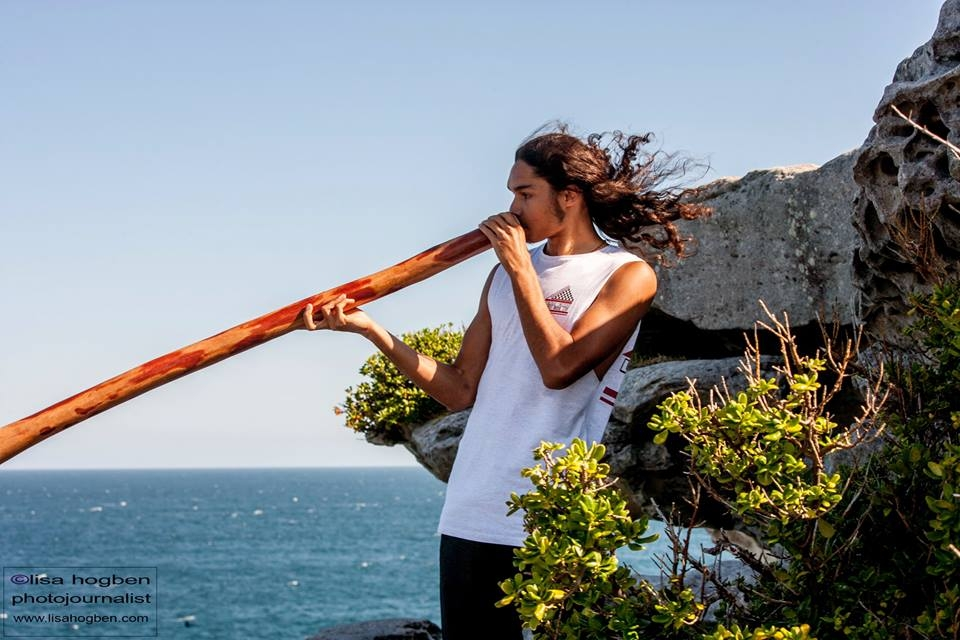

Born in Reunion Island in 1998, of an Aboriginal Australian musician father and a French art therapist mother, Youva grew in an artistic background and this legacy led him to the passionate practice of the didgeridoo.

At 12 he discovers the C language in a internet café in Sydney. Self-taught, he makes his first game (a Snake clone) in high school on his free time. At 18, he his admitted to the school 42 in Paris after a month-long exam. He develops a great interest in game design, which he refines by participating in game jams.

Apart from game development, he likes playing music, circus arts, japanese culture, and he also can be an avid and eclectic reader. Essentially, Youva is driven by his love of creating and discovering new things.

